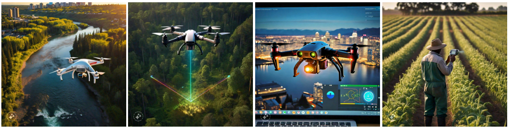

# Drone :material-drone:

Discover the cutting-edge world of data acquisition with drones, now made easier than ever with the power of AI. Our innovative technology streamlines the process, offering unparalleled efficiency and accuracy.

{ width="1000" }

## Vehicle detection

Object detection models empower us to analyze workflow traffic in cities, offering valuable insights into urban mobility patterns and enhancing infrastructure planning.

<video width="1000" controls>
    <source src="../videos/park-lot.mp4" type="video/mp4">
</video>

<video width="1000" controls>
    <source src="../videos/parking-lot2.mp4" type="video/mp4">
</video>

<video width="1000" controls>
    <source src="../videos/highway10.mp4" type="video/mp4">
</video>

=== ":octicons-image-16: Image "

    [![Linked content car2]][Linked content car2]

=== ":fontawesome-solid-wand-magic-sparkles: Predictions "

    [![Linked content car predictions2]][Linked content car predictions2]

<!-- === "Shapefile"

    [![Linked content tabs shp]][Linked content tabs disabled] -->

  [instant loading]: ./detect_images/image3.png
  [Linked content car2]: ./detect_images/image3.png
  [Linked content car predictions2]: ./detect_images/image3_out.png
<!-- :airplane_small: -->

=== ":octicons-image-16: Image"

    [![Linked content car]][Linked content car]

=== ":fontawesome-solid-wand-magic-sparkles: Predictions"

    [![Linked content car predictions]][Linked content car predictions]

<!-- === "Shapefile"

    [![Linked content tabs shp]][Linked content tabs disabled] -->

  [instant loading]: ./detect_images/air.png
  [Linked content car]: ./detect_images/air.png
  [Linked content car predictions]: ./detect_images/air_output.png

[Request :fontawesome-solid-paper-plane:](../page5-contact.md/){ .md-button }

## Parking Lot detection

We can swiftly identify parking lots and efficiently count their numbers, facilitating urban planning and management.

=== ":octicons-image-16: Image"

    [![Linked content tabs enabled]][Linked content tabs enabled]

=== ":fontawesome-solid-wand-magic-sparkles: Predictions"

    [![Linked content tabs disabled]][Linked content tabs disabled]

<!-- === "Shapefile"

    [![Linked content tabs shp]][Linked content tabs disabled] -->

  [instant loading]: ./detect_images/site15b_demo.jpg
  [Linked content tabs enabled]: ./detect_images/site15b_demo.jpg
  [Linked content tabs disabled]: ./detect_images/Site15b_demop.jpg

<video width="1000" controls>
    <source src="../videos/lot-only-trim.mp4" type="video/mp4">
</video>

[Request :fontawesome-solid-paper-plane:](../page5-contact.md/){ .md-button }
## Road marking segmentation

We can assess the condition of road marking lines with precision, ensuring optimal road safety and maintenance standards.

=== ":octicons-image-16: Image"

    [![Linked content tree]][Linked content tree]

=== ":fontawesome-solid-wand-magic-sparkles: Predictions"

    [![Linked content tree predictions]][Linked content tree predictions]

<!-- === "Shapefile"

    [![Linked content tabs shp]][Linked content tabs disabled] -->

  [instant loading]: ./detect_images/seg-road-input2.png
  [Linked content tree]: ./detect_images/seg-road-input2.png
  [Linked content tree predictions]: ./detect_images/seg-road-output2.png

=== ":octicons-image-16: Image"

    [![Linked content road]][Linked content road]

=== ":fontawesome-solid-wand-magic-sparkles: Predictions"

    [![Linked content road predictions]][Linked content road predictions]

<!-- === "Shapefile"

    [![Linked content tabs shp]][Linked content tabs disabled] -->

  [instant loading]: ./detect_images/seg-road-input3.png
  [Linked content road]: ./detect_images/seg-road-input3.png
  [Linked content road predictions]: ./detect_images/seg-road-output3.png

=== ":octicons-image-16: Image"

    [![Linked content road4]][Linked content road4]

=== ":fontawesome-solid-wand-magic-sparkles: Predictions"

    [![Linked content road4 predictions]][Linked content road4 predictions]

<!-- === "Shapefile"

    [![Linked content tabs shp]][Linked content tabs disabled] -->

  [instant loading]: ./detect_images/seg-road-input4.png
  [Linked content road4]: ./detect_images/seg-road-input4.png
  [Linked content road4 predictions]: ./detect_images/seg-road-output4.png

=== ":octicons-image-16: Image"

    [![Linked content road5]][Linked content road5]

=== ":fontawesome-solid-wand-magic-sparkles: Predictions"

    [![Linked content road5 predictions]][Linked content road5 predictions]

<!-- === "Shapefile"

    [![Linked content tabs shp]][Linked content tabs disabled] -->

  [instant loading]: ./detect_images/seg-road-input5.png
  [Linked content road5]: ./detect_images/seg-road-input5.png
  [Linked content road5 predictions]: ./detect_images/seg-road-output5.png

[Request :fontawesome-solid-paper-plane:](../page5-contact.md/){ .md-button }
