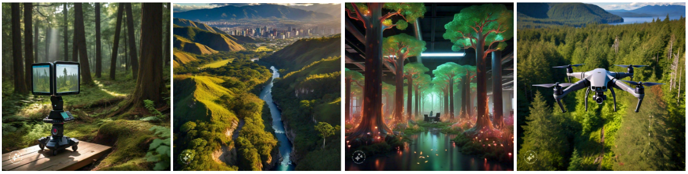
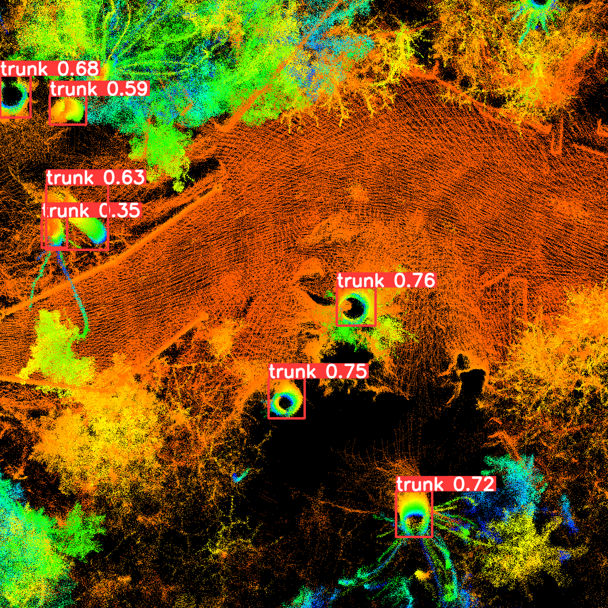
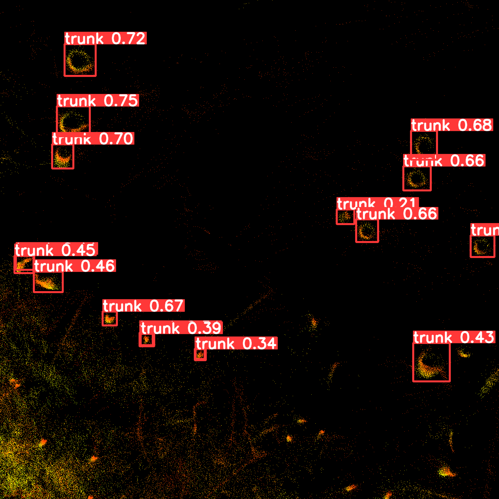

# Forestry :material-pine-tree-variant:

Utilizing object detection workflows, we can accurately count trees within point clouds and extract their shapes, enabling precise analysis of forested areas.

{ width="1000" }

## Trunk detection from LiDAR

<video width="600" controls>
    <source src="../videos/Arboristdemo.mp4" type="video/mp4">
</video>

## Trunk counting
{ width="600" }
{ width="600" }
{ width="600" }

[Request :fontawesome-solid-paper-plane:](../page5-contact.md/){ .md-button }
